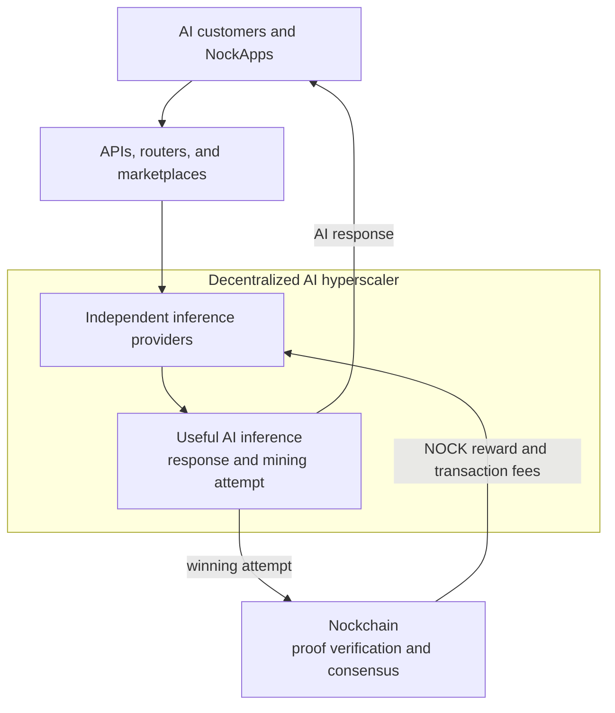

# The AI Compute Network

**The AI Compute Network is how Nockchain incentivizes a decentralized cloud for AI inference. Independent providers serve AI customers and use the same compute to compete for NOCK block rewards. Together, those providers can form a decentralized AI hyperscaler.**

A decentralized AI hyperscaler is a large AI cloud operated by many independent providers instead of one company. Nockchain does not own the GPUs or serve the customer requests. It provides the shared incentive and consensus protocol. Successful block producers earn NOCK, Nockchain’s fair digital gold.

## The Product Vision

AI inference is the service that produces answers from trained AI models. Today, a small number of large cloud companies control much of the hardware and infrastructure for this service.

The AI Compute Network creates a different model:

- Independent providers operate AI models and GPUs.
- Customers buy inference from those providers.
- Routers and marketplaces connect customers to available providers.
- Nockchain rewards providers when their inference work produces valid blocks.

Customers can use a normal AI API. They do not need to understand mining or interact with Nockchain.

Nockchain gives providers an additional reason to offer AI capacity. A provider can earn customer revenue for inference and compete for NOCK rewards with the same compute.

## How AI Inference Becomes Nockchain Mining

AI inference uses large amounts of matrix multiplication. The AI Compute Network makes selected matrix multiplication part of a Nockchain Proof of Useful Work puzzle.

The process is simple:

1. A customer sends an inference request to an independent provider.
2. The provider runs the AI model and performs the matrix multiplication needed for the response.
3. The provider uses that same work as a mining attempt tied to the current Nockchain block.
4. The customer receives the AI response whether or not the mining attempt wins.
5. If the attempt meets the mining target, the provider creates a compact proof and submits a block to Nockchain.
6. If Nockchain accepts the block, the provider receives NOCK and transaction fees.

Most attempts do not produce a block. They still produce useful AI responses. Nockchain does not pay a fixed amount for every request. It pays the provider that produces an accepted block.

The important point is that the provider does not perform useful inference and then run an unrelated mining task. The useful matrix computation is the mining work.

## Why Providers Participate

An inference provider can receive two kinds of revenue from the same GPU work:

1. Customer payments for AI inference.
2. A chance to earn NOCK block rewards and transaction fees.

The expected mining revenue can reduce the provider’s net cost of serving inference. A provider can keep the additional margin, lower prices, buy more GPUs, or offer capacity in more locations.

This incentive can attract independent GPU operators that would otherwise struggle to compete with centralized cloud providers.

Block rewards can also help providers keep capacity available while customer demand is still growing. Paid customer requests make that capacity useful. The combination supports both the early supply of GPUs and the long-term demand for inference.

## How the Decentralized Hyperscaler Forms

Nockchain provides the common incentive. Independent businesses provide the cloud products.

Those products can include:

- Inference providers that operate models and GPUs.
- APIs that accept customer requests.
- Routers that select providers by model, price, location, or availability.
- Marketplaces that handle provider discovery and billing.
- Monitoring services that measure speed and uptime.

Several providers, routers, and marketplaces can use the same AI Compute Network. No single company needs to own the GPUs, customer relationships, or service infrastructure.

As more providers join, the network gains more capacity, more geographic coverage, and more customer choice. The combined capacity can grow to cloud scale while remaining independently operated.

That is the decentralized AI hyperscaler: a large inference cloud connected by an open economic protocol rather than controlled by one cloud company.

## What Nockchain Provides

Nockchain provides the AI Proof of Useful Work puzzle, block candidates, mining targets, proof verification, and NOCK rewards. These are the shared rules that let independent inference providers contribute to the same consensus system.

Nockchain does not provide one central inference API. It does not route requests, bill customers, or guarantee model quality and uptime. Providers, routers, and marketplaces provide those product services.

This separation allows many inference products to compete while using the same Nockchain incentive.

## How It Fits Into Nockchain

The AI Compute Network is one of Nockchain’s Compute Networks. A Compute Network is a Proof of Useful Work puzzle that can produce Nockchain blocks.

The AI Compute Network runs beside the ZK Compute Network. Both can produce blocks for the same chain. Nockchain measures both kinds of work and accepts the valid chain with the most total work.

This connects the AI product to the rest of Nockchain:

- **AI customers** create demand for useful inference.
- **Inference providers** turn that demand into AI service and Nockchain mining attempts.
- **NockApps** can buy inference and use the results in their products.
- **Nockchain nodes** verify winning proofs and blocks.
- **NOCK** rewards the providers whose useful work secures the chain.

More inference demand produces more useful mining work. More provider capacity increases the decentralized cloud that NockApps and other AI customers can use.

## Where Participants Fit

- **AI customers** buy inference through normal APIs.
- **Inference providers** operate models and GPUs, serve requests, and compete for blocks.
- **Routers and marketplaces** connect customers with independent providers.
- **NockApp developers** use decentralized inference in their products.
- **Node operators** verify AI Compute Network proofs and blocks.
- **NOCK holders** hold an asset secured in part by useful AI computation.

## How It Fits Together

Customer payments support useful AI service. NOCK rewards pay providers for using the same compute to secure Nockchain. The shared incentive allows independent providers to grow into a decentralized AI hyperscaler.
