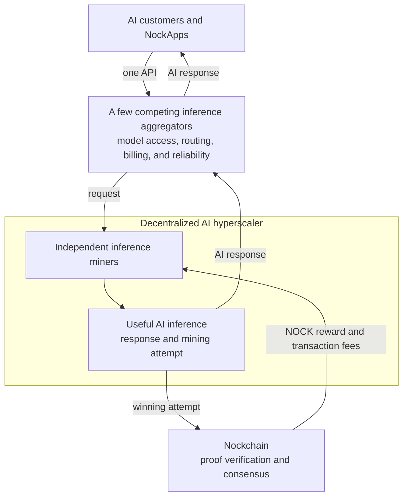

# The AI Compute Network

**Nockchain uses the AI Compute Network to support a decentralized cloud for AI inference. Independent providers serve AI customers. They use the same compute to compete for NOCK block rewards. Together, these providers can form a decentralized AI hyperscaler.**

Many independent providers operate a decentralized AI hyperscaler. No single company controls the large AI cloud. Nockchain does not own the GPUs or serve customer requests. Nockchain provides the shared incentive and consensus protocol. Successful block producers earn NOCK, Nockchain’s fair digital gold.

## The Product Vision

AI inference produces answers from AI models. Today, a small number of large cloud companies control much of the hardware and infrastructure for this service.

The AI Compute Network creates a different model:

- Independent providers operate AI models and GPUs.
- Customers use a small number of competing aggregators to buy inference.
- Aggregators route requests across available providers.
- Nockchain rewards providers when their inference work produces valid blocks.

**Inference miners** serve AI requests and use the same compute for Nockchain mining. Customers use a normal AI API through an aggregator. They do not need to understand mining or interact with Nockchain.

Nockchain gives inference miners an additional reason to offer AI capacity. An inference miner can earn customer revenue and compete for NOCK rewards with the same compute.

## How AI Inference Becomes Nockchain Mining

AI inference uses large amounts of matrix multiplication. The AI Compute Network makes selected matrix multiplication part of a Nockchain Proof of Useful Work puzzle.

The process is simple:

1. A customer sends an inference request to an aggregator.
2. The aggregator selects an independent inference miner.
3. The inference miner runs the AI model and performs the matrix multiplication needed for the response.
4. The inference miner uses that same work as a mining attempt and ties it to the current Nockchain block.
5. The customer receives the AI response whether or not the mining attempt wins.
6. If the attempt meets the mining target, the inference miner creates a compact proof and submits a block to Nockchain.
7. If Nockchain accepts the block, the inference miner receives NOCK and transaction fees.

Most attempts do not produce a block. They still produce useful AI responses. Nockchain does not pay a fixed amount for every request. It pays the inference miner that produces an accepted block.

The inference miner uses the useful matrix computation as mining work. The miner does not run an unrelated mining task after the inference.

## Why Inference Miners Participate

An inference miner can receive two kinds of revenue from the same GPU work:

1. Customer payments for AI inference.
2. A chance to earn NOCK block rewards and transaction fees.

The expected mining revenue can reduce the inference miner’s net cost of serving inference. The inference miner can keep the additional margin, lower prices, buy more GPUs, or offer capacity in more locations.

This incentive can attract independent GPU operators that would otherwise struggle to compete with centralized cloud providers.

Block rewards can also help inference miners keep capacity available while customer demand is still growing. Paid customer requests make that capacity useful. The combination supports both the early supply of GPUs and the long-term demand for inference.

## How the Decentralized Hyperscaler Forms

Nockchain provides the common incentive. Inference miners and aggregators provide the cloud products.

Many independent inference miners can join the same AI Compute Network. They can operate different hardware, models, and locations. No single company needs to own the full compute supply.

As more inference miners join, the network gains capacity, geographic coverage, and customer choice. Independent operators keep control as the combined capacity grows to cloud scale.

An open economic protocol connects this large inference cloud. One cloud company does not control it. This structure creates the decentralized AI hyperscaler.

## The Inference Aggregator Layer

Users should not need to find and integrate with every inference miner separately. We intend to unify access through a small number of competing **inference aggregators**.

An aggregator can:

- Give users one API for many inference miners.
- List available models in one catalog.
- Route requests by model, price, location, speed, or availability.
- Balance traffic and find another miner when one becomes busy or goes offline.
- Give customers one account and billing system.
- Monitor response speed and service uptime.

Inference miners can connect their capacity to one or more aggregators. A customer or NockApp chooses an aggregator and sends requests to one endpoint. The aggregator selects an available inference miner, returns the response, and handles the customer-facing service.

We intend to have a few aggregators rather than one required aggregator. This gives users a simple interface without creating one central gatekeeper. Aggregators can compete on price, routing, model access, reliability, and customer experience. Inference miners can work with several aggregators, and customers can switch between them.

The aggregators unify the product experience. Independent operators continue to control the GPUs and model servers.

## What Nockchain Provides

Nockchain provides the AI Proof of Useful Work puzzle, block candidates, and mining targets. It verifies winning proofs and pays NOCK rewards. These shared rules let independent inference miners contribute to the same consensus system.

Nockchain does not provide one central inference API. It does not route requests, bill customers, or guarantee model quality and uptime. Inference aggregators provide those customer-facing services.

A few easy-to-use aggregators can compete for customers. Many independent inference miners can use the same Nockchain incentive.

## How It Fits Into Nockchain

Nockchain uses the AI Compute Network as one of its Compute Networks. Each Compute Network defines a Proof of Useful Work puzzle that can produce Nockchain blocks.

The AI Compute Network produces blocks for Nockchain. Nockchain converts work from every active Compute Network into a common measure. It accepts the valid chain with the most total work.

This connects the AI product to the rest of Nockchain:

- **AI customers and NockApps** use aggregators to request inference.
- **Inference aggregators** provide a simple API and route requests across many inference miners.
- **Inference miners** turn those requests into AI service and Nockchain mining attempts.
- **Nockchain nodes** verify winning proofs and blocks.
- **NOCK** rewards the inference miners whose useful work secures the chain.

More inference demand produces more useful mining work. More inference miners increase the decentralized cloud available through each aggregator.

## Where Participants Fit

- **AI customers** buy inference through an aggregator’s API.
- **Inference miners** operate models and GPUs, serve requests from aggregators, and compete for blocks.
- **Inference aggregators** unify model access, routing, billing, and reliability across many miners.
- **NockApp developers** use an aggregator to add decentralized inference to their products.
- **Node operators** verify AI Compute Network proofs and blocks.
- **NOCK holders** own an asset that useful AI computation helps secure.

## How It Fits Together

Aggregators give users one simple interface to many inference miners. Customer payments support useful AI service. NOCK rewards pay inference miners for using the same compute to secure Nockchain. The combined capacity becomes a decentralized AI hyperscaler.
