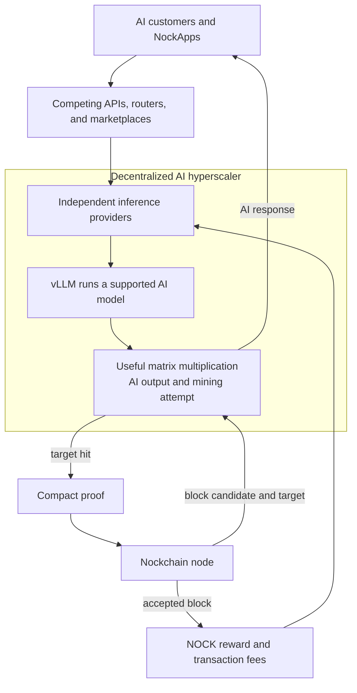

# The AI Compute Network

**The AI Compute Network turns AI inference into a Proof of Useful Work puzzle. Independent inference providers can earn customer payments and compete for NOCK block rewards with the same GPU work. Together, those providers can form a decentralized AI hyperscaler.**

A decentralized AI hyperscaler is a large inference cloud operated by many independent providers instead of one company. Nockchain does not own the GPUs or serve customer requests. It provides a common mining protocol and pays successful block producers in NOCK.

## The Core Idea

AI inference is the process that produces an answer from a trained AI model. Most of this work is matrix multiplication. GPUs multiply large groups of numbers across many model layers for every request.

The AI Compute Network makes selected matrix multiplication part of Nockchain mining. A specialized GPU operation produces the normal inference output and a Nockchain mining attempt from the same computation. The provider does not run a separate hash-mining loop after the inference.

This gives the computation two uses:

1. It produces an answer for an AI customer.
2. It gives the provider a chance to produce a Nockchain block.

The customer can use a normal AI API. The customer does not need to understand mining or interact with Nockchain.

## How an Inference Request Becomes a Mining Attempt

The process has eight steps:

1. A Nockchain node gives the inference provider a current block candidate and an AI mining target.
2. A customer sends an inference request to the provider.
3. The provider’s model server groups the request with other work and runs the model.
4. A selected matrix multiplication runs through the AI mining operation. The operation is tied to the current block candidate, the model matrices, and a unique mining attempt.
5. The operation produces the clean matrix output needed by the model. It also produces a value that is checked against the AI mining target.
6. The model continues generating the customer’s answer. A normal attempt does not create a proof and does not delay the response.
7. If the value meets the target, the provider builds a compact proof of the mining work and submits a candidate block.
8. Nockchain nodes verify the proof. If the block is valid and current, the provider receives the miner’s share of the NOCK block reward and the block’s transaction fees.

Most attempts do not meet the target. They still produce useful inference output. A provider receives mining revenue only when an attempt meets the target and Nockchain accepts the block.

The proof is built only after a target hit. Proof construction runs separately and does not hold the customer response open. If Nockchain has already moved to a newer block candidate, the old result cannot produce a valid block.

## The Initial Inference Service

The initial implementation serves Gemma 4 31B through vLLM, software that runs AI models behind an API. Applications use an OpenAI-compatible HTTP API for chat completions and streaming responses.

The mineable operation is one of the large matrix multiplications inside the model. That operation produces both the correct inference output and the AI mining result. Other model operations continue to run as normal inference work.

The supported production layouts are:

- One NVIDIA H100.
- One RTX PRO 6000 Blackwell.
- Two RTX 5090 GPUs.

The model server and the AI mining bridge run as separate services in one deployment. The model server handles requests, model state, and GPU execution. The bridge receives Nockchain block candidates, validates target hits, builds proofs, and submits blocks.

Normal inference requests do not send model tensors through the bridge. On the rare target hit, the provider sends the matrix data needed to prove the winning work. The proof worker checks the work again before it creates a block proof.

When no inference request is active, the deployment can use idle GPU time for AI mining. Active inference work pauses new idle-mining batches and uses the customer workload. Idle mining can earn NOCK, but only customer requests produce useful inference service.

## Why Inference Providers Participate

An inference provider can receive two kinds of revenue from the same GPU operation:

1. Payment from a customer for the AI response.
2. A chance to earn NOCK block rewards and transaction fees.

Nockchain does not pay a fixed amount for every inference request. Mining income is based on target hits and accepted blocks. Over many attempts, the expected mining income can reduce the provider’s net cost of serving inference.

A provider can use that additional income in several ways:

- Lower inference prices.
- Increase operating margin.
- Buy more GPUs.
- Serve models or locations that would otherwise be uneconomic.
- Keep capacity available while customer demand grows.

The protocol therefore gives independent GPU operators an economic reason to offer inference capacity instead of competing only with centralized cloud providers.

## How the Decentralized AI Hyperscaler Forms

Nockchain supplies the mining incentive. Independent products supply the cloud services around it.

The full service can include:

- Inference providers that operate models and GPUs.
- Public or private APIs that accept customer requests.
- Routers that select a provider by model, price, location, or availability.
- Marketplaces that handle provider discovery and billing.
- Monitoring systems that measure latency, uptime, and response errors.
- Applications and NockApps that buy inference.

These services do not need one central owner. Several providers, routers, and marketplaces can use the same AI Compute Network.

The sequence is direct:

1. Customers create demand for inference.
2. Independent providers earn customer payments for serving that demand.
3. The same inference work creates Nockchain mining attempts.
4. Successful providers earn NOCK from accepted blocks.
5. The additional expected revenue attracts more inference capacity.
6. More providers increase model capacity, geographic coverage, and customer choice.
7. More AI work also increases the useful computation securing Nockchain.

The combined capacity can grow to cloud scale without placing all GPUs, customers, or service control under one company. This is a decentralized AI hyperscaler.

## What Nockchain Provides

Nockchain provides:

- The AI Proof of Useful Work rules.
- Current block candidates and mining targets.
- A proof format that binds AI work to a candidate block.
- Verification of winning proofs.
- Difficulty adjustment and chain-weight accounting.
- NOCK block rewards and transaction fees for accepted blocks.

Nockchain does not provide:

- A central inference API.
- Request routing.
- Customer billing.
- Guaranteed model quality, latency, or uptime.
- Privacy for prompts and responses by default.
- A central list of approved providers.

The inference product layer must provide those services. Nockchain verifies the mining work. It does not decide whether an AI response is useful, safe, or correct for the customer.

## How the AI Compute Network Secures Nockchain

The AI Compute Network runs beside the ZK Compute Network. Both can produce blocks for the same Nockchain.

The AI Compute Network has its own difficulty target. As AI capacity changes, its difficulty changes. Nockchain converts AI work and ZK work into the same measure, then accepts the valid chain with the most total work.

More participating inference capacity means more AI work protects the chain. Difficulty adjustment keeps block production controlled while the total work required to replace the valid chain grows.

Demand for AI inference creates useful matrix computation. The same computation contributes to Nockchain’s Proof of Useful Work security.

## Where Participants Fit

- **AI customers** send normal inference requests and pay for responses.
- **Inference providers** operate models and GPUs, serve customer requests, and submit winning AI blocks.
- **Routers and marketplaces** connect customers to independent providers and handle service-level concerns.
- **Nockchain nodes** provide block candidates and verify submitted AI proofs.
- **NockApp developers** can buy inference from the provider network and use the results in their products.
- **NOCK holders** use an asset secured in part by useful AI computation.

## How It Fits Together

The AI Compute Network gives independent inference providers a common economic incentive. Customer payments fund useful AI service. NOCK rewards pay for the same compute to secure Nockchain. The combined provider capacity becomes a decentralized AI hyperscaler.
