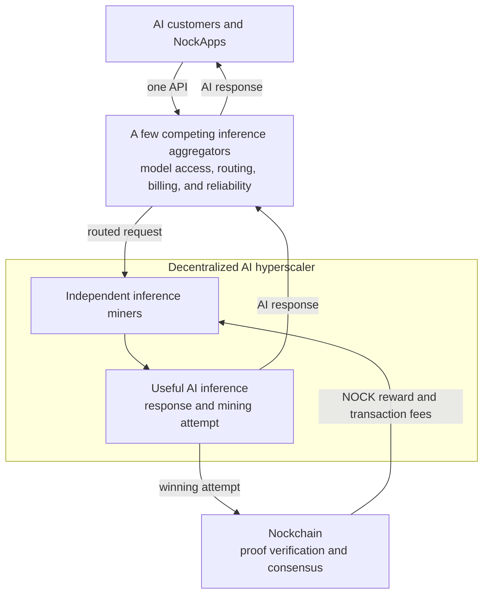

# The AI Compute Network

**The AI Compute Network is how Nockchain incentivizes a decentralized cloud for AI inference. Independent providers serve AI customers and use the same compute to compete for NOCK block rewards. Together, those providers can form a decentralized AI hyperscaler.**

A decentralized AI hyperscaler is a large AI cloud operated by many independent providers instead of one company. Nockchain does not own the GPUs or serve the customer requests. It provides the shared incentive and consensus protocol. Successful block producers earn NOCK, Nockchain’s fair digital gold.

## The Product Vision

AI inference is the service that produces answers from trained AI models. Today, a small number of large cloud companies control much of the hardware and infrastructure for this service.

The AI Compute Network creates a different model:

- Independent providers operate AI models and GPUs.
- Customers use a small number of competing aggregators to buy inference.
- Aggregators route requests across available providers.
- Nockchain rewards providers when their inference work produces valid blocks.

An **inference miner** is a provider that serves AI requests and uses the same compute for Nockchain mining. Customers can use a normal AI API through an aggregator. They do not need to understand mining or interact with Nockchain.

Nockchain gives inference miners an additional reason to offer AI capacity. An inference miner can earn customer revenue and compete for NOCK rewards with the same compute.

## How AI Inference Becomes Nockchain Mining

AI inference uses large amounts of matrix multiplication. The AI Compute Network makes selected matrix multiplication part of a Nockchain Proof of Useful Work puzzle.

The process is simple:

1. A customer sends an inference request to an aggregator.
2. The aggregator selects an independent inference miner.
3. The inference miner runs the AI model and performs the matrix multiplication needed for the response.
4. The inference miner uses that same work as a mining attempt tied to the current Nockchain block.
5. The customer receives the AI response whether or not the mining attempt wins.
6. If the attempt meets the mining target, the inference miner creates a compact proof and submits a block to Nockchain.
7. If Nockchain accepts the block, the inference miner receives NOCK and transaction fees.

Most attempts do not produce a block. They still produce useful AI responses. Nockchain does not pay a fixed amount for every request. It pays the inference miner that produces an accepted block.

The important point is that the inference miner does not perform useful inference and then run an unrelated mining task. The useful matrix computation is the mining work.

## Why Inference Miners Participate

An inference miner can receive two kinds of revenue from the same GPU work:

1. Customer payments for AI inference.
2. A chance to earn NOCK block rewards and transaction fees.

The expected mining revenue can reduce the inference miner’s net cost of serving inference. The inference miner can keep the additional margin, lower prices, buy more GPUs, or offer capacity in more locations.

This incentive can attract independent GPU operators that would otherwise struggle to compete with centralized cloud providers.

Block rewards can also help inference miners keep capacity available while customer demand is still growing. Paid customer requests make that capacity useful. The combination supports both the early supply of GPUs and the long-term demand for inference.

## How the Decentralized Hyperscaler Forms

Nockchain provides the common incentive. Inference miners and aggregators provide the cloud products.

Many independent inference miners can join the same AI Compute Network. They can operate different hardware, models, and locations. No single company needs to own the full compute supply.

As more inference miners join, the network gains more capacity, more geographic coverage, and more customer choice. The combined capacity can grow to cloud scale while remaining independently operated.

That is the decentralized AI hyperscaler: a large inference cloud connected by an open economic protocol rather than controlled by one cloud company.

## The Inference Aggregator Layer

Users should not need to find and integrate with every inference miner separately. We intend to unify access through a small number of competing **inference aggregators**.

An aggregator can provide:

- One API for many inference miners.
- One catalog of available models.
- Request routing by model, price, location, speed, or availability.
- Load balancing and failover when a provider is busy or offline.
- One customer account and billing system.
- Common monitoring for response speed and service uptime.

Inference miners can connect their capacity to one or more aggregators. A customer or NockApp chooses an aggregator and sends requests to one endpoint. The aggregator selects an available inference miner, returns the response, and handles the customer-facing service.

We intend to have a few aggregators rather than one required aggregator. This gives users a simple interface without creating one central gatekeeper. Aggregators can compete on price, routing, model access, reliability, and customer experience. Inference miners can work with several aggregators, and customers can switch between them.

The aggregators unify the product experience. The underlying GPUs and model servers remain independently operated.

## What Nockchain Provides

Nockchain provides the AI Proof of Useful Work puzzle, block candidates, mining targets, proof verification, and NOCK rewards. These are the shared rules that let independent inference providers contribute to the same consensus system.

Nockchain does not provide one central inference API. It does not route requests, bill customers, or guarantee model quality and uptime. Inference aggregators provide those customer-facing services.

This separation allows a few easy-to-use aggregators to compete while many independent inference miners use the same Nockchain incentive.

## How It Fits Into Nockchain

The AI Compute Network is one of Nockchain’s Compute Networks. A Compute Network is a Proof of Useful Work puzzle that can produce Nockchain blocks.

The AI Compute Network runs beside the ZK Compute Network. Both can produce blocks for the same chain. Nockchain measures both kinds of work and accepts the valid chain with the most total work.

This connects the AI product to the rest of Nockchain:

- **AI customers and NockApps** use aggregators to request inference.
- **Inference aggregators** provide a simple API and route requests across many inference miners.
- **Inference miners** turn those requests into AI service and Nockchain mining attempts.
- **Nockchain nodes** verify winning proofs and blocks.
- **NOCK** rewards the inference miners whose useful work secures the chain.

More inference demand produces more useful mining work. More inference miners increase the decentralized cloud available through each aggregator.

## Where Participants Fit

- **AI customers** buy inference through an aggregator’s API.
- **Inference miners** operate models and GPUs, serve routed requests, and compete for blocks.
- **Inference aggregators** unify model access, routing, billing, and reliability across many miners.
- **NockApp developers** use an aggregator to add decentralized inference to their products.
- **Node operators** verify AI Compute Network proofs and blocks.
- **NOCK holders** hold an asset secured in part by useful AI computation.

## How It Fits Together

Aggregators give users one simple interface to many inference miners. Customer payments support useful AI service. NOCK rewards pay inference miners for using the same compute to secure Nockchain. The combined capacity becomes a decentralized AI hyperscaler.
