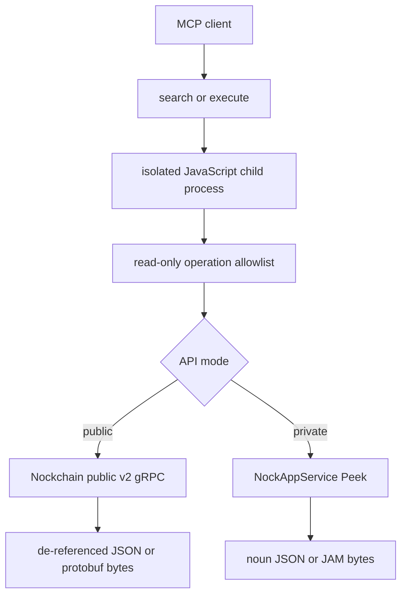

# Nockchain code-mode MCP

`nockchain-mcp` gives an agent read-only access to Nockchain's gRPC APIs through two MCP tools: `search` and `execute`. It deliberately does not turn every RPC into an MCP tool.

This is alpha software over alpha Nockchain APIs. Treat operation names, protobuf messages, peek paths, and the repository's current public endpoint as unstable.

## What is exposed

- `search` runs JavaScript over an in-memory query catalog. It cannot contact a node.
- `execute` runs JavaScript that can compose allowlisted read calls, inspect the catalog, or explain a call as gRPC.
- Public mode uses the public v2 protobuf services.
- Private mode uses only `NockAppService.Peek` with JAM-encoded paths and results.
- JSON results are expanded for agent evaluation. Native results preserve protobuf response bytes in public mode and JAM bytes in private mode.

The public mutation `WalletSendTransaction`, private `Poke`, and private `WatchEffects` are not in the catalog or dispatch code. Naming one produces an error.



## Build

From the repository root:

```bash
cargo build --release -p nockchain-mcp
```

The executable is `target/release/nockchain-mcp`. Use `cargo run --release -p nockchain-mcp -- --help` to see every limit, TLS, authentication, and backend option.

## Connect an MCP client over stdio

Public mode defaults to the same plaintext public endpoint currently documented by the wallet, `23.252.122.18:5556`:

```json
{
  "mcpServers": {
    "nockchain": {
      "command": "/absolute/path/to/nockchain/target/release/nockchain-mcp",
      "args": [
        "--mode", "public",
        "--grpc-backend", "http://23.252.122.18:5556"
      ]
    }
  }
}
```

For a node's localhost-only API, use private mode:

```json
{
  "mcpServers": {
    "nockchain-private": {
      "command": "/absolute/path/to/nockchain/target/release/nockchain-mcp",
      "args": [
        "--mode", "private",
        "--grpc-backend", "http://127.0.0.1:5555"
      ]
    }
  }
}
```

`NOCKCHAIN_GRPC_BACKEND`, `NOCKCHAIN_MCP_MODE`, and `NOCKCHAIN_GRPC_TIMEOUT_MS` are environment-variable equivalents.

## Host Streamable HTTP or HTTPS

Serve Streamable HTTP at `http://127.0.0.1:3000/mcp`:

```bash
NOCKCHAIN_MCP_BEARER_TOKEN='replace-me' \
cargo run --release -p nockchain-mcp -- \
  --mode public \
  --grpc-backend http://127.0.0.1:5556 \
  --transport http \
  --bind 127.0.0.1:3000
```

The unauthenticated health check is `GET /health`. The `/mcp` route requires `Authorization: Bearer replace-me` when a token is configured.

For direct HTTPS, add a PEM certificate chain and private key:

```bash
nockchain-mcp \
  --mode public \
  --grpc-backend http://127.0.0.1:5556 \
  --transport http \
  --bind 0.0.0.0:443 \
  --tls-cert /run/secrets/fullchain.pem \
  --tls-key /run/secrets/privkey.pem \
  --bearer-token 'replace-me'
```

An authenticated TLS reverse proxy in front of a loopback HTTP listener is also appropriate. Do not expose the MCP or the alpha public gRPC listener without an access-control layer you trust.

## Code-mode API

Tool arguments contain one `code` property. Return JSON-serializable data from an arrow function.

### Discover queries

Call `search` with:

```javascript
async () => codemode.spec().operations
  .filter(op => op.name.includes("transaction"))
  .map(({ name, summary, inputExample, requestSchema }) => ({
    name,
    summary,
    inputExample,
    requestSchema,
  }))
```

The public catalog currently contains these read operations:

- `wallet_get_balance`
- `transaction_accepted`
- `get_blocks`
- `get_block_details`
- `get_transaction_block`
- `get_transaction_details`
- `get_explorer_metrics`
- `get_peer_stats`
- `get_req_res_metrics`

The private catalog contains only `peek`.

### Query for agent-ready JSON

Call public-mode `execute` with:

```javascript
async () => {
  const result = await codemode.request({
    operation: "get_blocks",
    input: {
      page: {
        clientPageItemsLimit: 10,
        pageToken: "",
        maxBytes: "0",
      },
    },
    format: "json",
  });

  return result.data.blocks.blocks.map(block => ({
    height: block.height,
    blockId: block.blockId,
    transactionCount: block.txIds.length,
  }));
}
```

Protobuf wrapper objects such as `{ "value": ... }`, base58 hash/key wrappers, and five-belt Nockchain hashes are expanded or unwrapped in JSON mode. The envelope states the exact encoding used.

### Interpret block timestamps

Nockchain block `timestamp` values are Hoon-epoch absolute whole seconds, not Unix timestamps. Protobuf JSON represents the `uint64` as a decimal string, and its value exceeds JavaScript's safe-integer range. Parse it as a `BigInt` and subtract the Hoon-to-Unix epoch offset before using `Number` or `Date`:

```javascript
const HOON_UNIX_EPOCH_SECONDS = 9223372091860848000n;
const unixSeconds = BigInt(block.timestamp) - HOON_UNIX_EPOCH_SECONDS;
const date = new Date(Number(unixSeconds) * 1000);
```

Do not call `Number(block.timestamp)` first; doing so loses precision. The same conversion and warning are included in MCP initialization instructions, the `execute` tool description, and the catalog returned by `codemode.spec()`.

### Preserve native data

For a public protobuf response:

```javascript
async () => codemode.request({
  operation: "get_explorer_metrics",
  input: {},
  format: "native",
})
```

The result includes `encoding: "protobuf"`, the response `messageType`, and `dataBase64`. Decode those bytes with the repository's embedded descriptor set or the `.proto` file reported by `search` or `explain`.

For private `peek`, native mode returns `encoding: "jam"` and `dataBase64`. JSON mode cues the JAM and returns a lossless noun tree. Atom nodes contain little-endian base64 and hex, plus `unsigned` or UTF-8 `text` when those interpretations are valid.

### Explain a query as gRPC

`explain` does not contact the node:

```javascript
async () => codemode.explain({
  operation: "get_blocks",
  input: { page: { clientPageItemsLimit: 2 } },
})
```

It returns the service, method, full method path, request and response protobuf types, source proto file, normalized request JSON, backend target, transport-security mode, and an endpoint-specific `grpcurl` command. Nockchain's gRPC servers expose reflection, so the command does not need a local proto include path.

### Private peek paths

Convenience presets compile to the direct kernel peek paths already used by Nockchain's Rust clients:

```javascript
async () => codemode.request({
  operation: "peek",
  input: { path: { preset: "heaviest-chain" } },
  format: "json",
})
```

Argument-free presets are `heaviest-chain`, `heaviest-block`, `constants`, `blockchain-constants`, and `raw-transactions`. `heavy-n` takes an unsigned height argument. `block-transactions` and `raw-transaction` take a base58 string argument.

For paths not covered by a preset, provide either already encoded JAM or noun JSON:

```javascript
async () => codemode.request({
  operation: "peek",
  input: {
    pid: 0,
    path: { jamBase64: "..." },
  },
  format: "native",
})
```

```javascript
async () => codemode.explain({
  operation: "peek",
  input: {
    path: {
      noun: {
        cell: [
          { atom: { text: "heaviest-chain" } },
          { atom: { unsigned: "0" } }
        ]
      }
    }
  }
})
```

Noun atoms accept exactly one of `unsigned` (a JSON integer or decimal string), `text`, or `base64`. Cells are `{ "cell": [head, tail] }`.

## Run a Nockchain backend

First follow the repository root [setup and node instructions](../../README.md). A normal `nockchain` process exposes its private NockApp gRPC API on localhost, normally port `5555`; this is the backend for `--mode private`.

For public mode, use the purpose-built alpha API binary and keep its listener private unless it is behind a control layer:

```bash
cargo run --release -p nockchain-api -- \
  --bind-public-grpc-addr 127.0.0.1:5556 \
  <the same genesis, peer, identity, and data flags as your node>
```

See the [`nockchain-api` operator README](../nockchain-api/README.md) for cache warm-up, reorg, memory, PMA snapshot, metrics, and security details. In particular, the public API currently has no built-in authentication, authorization, or rate limiting.

If you only need public data and accept a third-party alpha endpoint, omit `--grpc-backend` to use the repository's current wallet default. There is no availability or compatibility guarantee; configure a node you control for utilities that need predictable behavior.

## Execution limits and trust boundary

Every program runs in a fresh child process. JavaScript receives no filesystem, environment, network, `fetch`, timer, dynamic import, or module API. Only the Rust-hosted read-only functions are registered. The host enforces operation allowlisting again before gRPC dispatch.

Defaults are 32 KiB of code, 32 backend calls, a 1 MiB JSON result, a 30-second wall limit, a Boa loop/recursion/stack limit, and a Unix CPU limit. Linux additionally applies a 512 MiB address-space limit. These values are defense in depth for agent-generated code, not a general-purpose hostile-code sandbox; deploy the server under normal process/container isolation for untrusted tenants.
