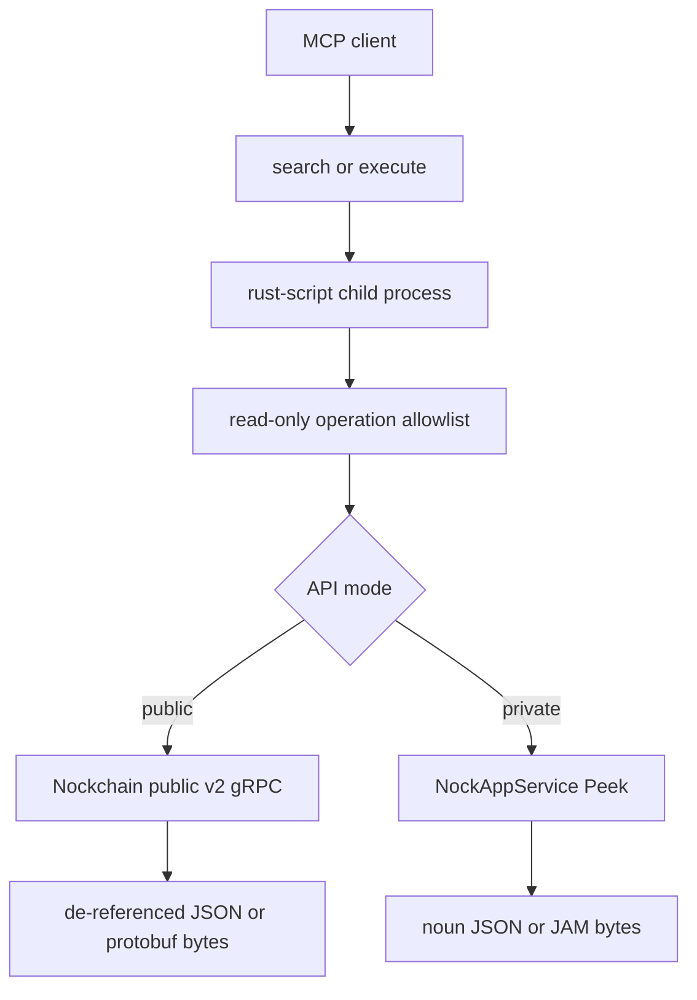

# Nockchain code-mode MCP

`nockchain-mcp` gives an agent read-only access to Nockchain's gRPC APIs through two MCP tools: `search` and `execute`. It deliberately does not turn every RPC into an MCP tool.

This is alpha software over alpha Nockchain APIs. Treat operation names, protobuf messages, peek paths, and the repository's current public endpoint as unstable.

## What is exposed

- `search` runs Rust over an in-memory query catalog. It cannot contact a node.
- `execute` runs Rust that can compose allowlisted read calls, inspect the catalog, or explain a call as gRPC.
- Public mode uses the public v2 protobuf services.
- Private mode uses only `NockAppService.Peek` with JAM-encoded paths and results.
- JSON results are expanded for agent evaluation. Native results preserve protobuf response bytes in public mode and JAM bytes in private mode.

The public mutation `WalletSendTransaction`, private `Poke`, and private `WatchEffects` are not in the catalog or dispatch code. Naming one produces an error.



## Build

From the repository root:

```bash
cargo install rust-script --locked
cargo build --release -p nockchain-mcp
```

The executable is `target/release/nockchain-mcp`. Rust code-mode requires [`rust-script`](https://rust-script.org/) on `PATH`; override its location with `--rust-script` or `NOCKCHAIN_MCP_RUST_SCRIPT`. Use `cargo run --release -p nockchain-mcp -- --help` to see every limit, TLS, authentication, and backend option.

## Connect an MCP client over stdio

Public mode defaults to the same plaintext public endpoint currently documented by the wallet, `23.252.122.18:5556`:

```json
{
  "mcpServers": {
    "nockchain": {
      "command": "/absolute/path/to/nockchain/target/release/nockchain-mcp",
      "args": [
        "--mode", "public",
        "--grpc-backend", "http://23.252.122.18:5556"
      ]
    }
  }
}
```

For a node's localhost-only API, use private mode:

```json
{
  "mcpServers": {
    "nockchain-private": {
      "command": "/absolute/path/to/nockchain/target/release/nockchain-mcp",
      "args": [
        "--mode", "private",
        "--grpc-backend", "http://127.0.0.1:5555"
      ]
    }
  }
}
```

`NOCKCHAIN_GRPC_BACKEND`, `NOCKCHAIN_MCP_MODE`, and `NOCKCHAIN_GRPC_TIMEOUT_MS` are environment-variable equivalents.

## Host Streamable HTTP or HTTPS

Serve Streamable HTTP at `http://127.0.0.1:3000/mcp`:

```bash
NOCKCHAIN_MCP_BEARER_TOKEN='replace-me' \
cargo run --release -p nockchain-mcp -- \
  --mode public \
  --grpc-backend http://127.0.0.1:5556 \
  --transport http \
  --bind 127.0.0.1:3000
```

The unauthenticated health check is `GET /health`. The `/mcp` route requires `Authorization: Bearer replace-me` when a token is configured.

For direct HTTPS, add a PEM certificate chain and private key:

```bash
nockchain-mcp \
  --mode public \
  --grpc-backend http://127.0.0.1:5556 \
  --transport http \
  --bind 0.0.0.0:443 \
  --tls-cert /run/secrets/fullchain.pem \
  --tls-key /run/secrets/privkey.pem \
  --bearer-token 'replace-me'
```

An authenticated TLS reverse proxy in front of a loopback HTTP listener is also appropriate. Do not expose the MCP or the alpha public gRPC listener without an access-control layer you trust.

## Code-mode API

Tool arguments contain one `code` property. Its value is a Rust function body with these names already in scope:

- `codemode: &mut Codemode`
- `serde_json::{json, Value}`
- `Format::{Json, Native}`

End the body with `Ok(value)`. The complete return type is `Result<serde_json::Value, String>`.
Do not write to stdout with `println!`; stdout carries the private protocol between the generated Rust client and the MCP host. Normal returned values become MCP structured content.

### Discover queries

Call `search` with:

```rust
let spec = codemode.spec()?;
let matches = spec["operations"]
    .as_array()
    .ok_or_else(|| "operations is not an array".to_string())?
    .iter()
    .filter(|operation| {
        operation["name"]
            .as_str()
            .is_some_and(|name| name.contains("transaction"))
    })
    .map(|operation| json!({
        "name": operation["name"],
        "summary": operation["summary"],
        "inputExample": operation["inputExample"],
        "requestSchema": operation["requestSchema"],
    }))
    .collect::<Vec<_>>();
Ok(json!(matches))
```

The public catalog currently contains these read operations:

- `wallet_get_balance`
- `transaction_accepted`
- `get_blocks`
- `get_block_details`
- `get_transaction_block`
- `get_transaction_details`
- `get_explorer_metrics`
- `get_peer_stats`
- `get_req_res_metrics`

The private catalog contains only `peek`.

### Query for agent-ready JSON

Call public-mode `execute` with:

```rust
let result = codemode.request(
    "get_blocks",
    json!({
        "page": {
            "clientPageItemsLimit": 10,
            "pageToken": "",
            "maxBytes": "0",
        },
    }),
    Format::Json,
)?;
let blocks = result
    .pointer("/data/blocks/blocks")
    .and_then(Value::as_array)
    .ok_or_else(|| "response has no blocks array".to_string())?;
let summaries = blocks.iter().map(|block| json!({
    "height": block["height"],
    "blockId": block["blockId"],
    "transactionCount": block["txIds"].as_array().map_or(0, Vec::len),
})).collect::<Vec<_>>();
Ok(json!(summaries))
```

Protobuf wrapper objects such as `{ "value": ... }`, base58 hash/key wrappers, and five-belt Nockchain hashes are expanded or unwrapped in JSON mode. The envelope states the exact encoding used.

### Interpret block timestamps

Nockchain block `timestamp` values are Hoon-epoch absolute whole seconds, not Unix timestamps. Protobuf JSON represents the `uint64` as a decimal string. Parse it as a `u64` and subtract the Hoon-to-Unix epoch offset:

```rust
const HOON_UNIX_EPOCH_SECONDS: u64 = 9_223_372_091_860_848_000;
let timestamp = block["timestamp"]
    .as_str()
    .ok_or_else(|| "timestamp is not a string".to_string())?
    .parse::<u64>()
    .map_err(|error| error.to_string())?;
let unix_seconds = timestamp - HOON_UNIX_EPOCH_SECONDS;
```

The same conversion and warning are included in MCP initialization instructions, the `execute` tool description, and the catalog returned by `codemode.spec()`.

### Preserve native data

For a public protobuf response:

```rust
codemode.request("get_explorer_metrics", json!({}), Format::Native)
```

The result includes `encoding: "protobuf"`, the response `messageType`, and `dataBase64`. Decode those bytes with the repository's embedded descriptor set or the `.proto` file reported by `search` or `explain`.

For private `peek`, native mode returns `encoding: "jam"` and `dataBase64`. JSON mode cues the JAM and returns a lossless noun tree. Atom nodes contain little-endian base64 and hex, plus `unsigned` or UTF-8 `text` when those interpretations are valid.

### Explain a query as gRPC

`explain` does not contact the node:

```rust
codemode.explain(
    "get_blocks",
    json!({"page": {"clientPageItemsLimit": 2}}),
)
```

It returns the service, method, full method path, request and response protobuf types, source proto file, normalized request JSON, backend target, transport-security mode, and an endpoint-specific `grpcurl` command. Nockchain's gRPC servers expose reflection, so the command does not need a local proto include path.

### Private peek paths

Convenience presets compile to the direct kernel peek paths already used by Nockchain's Rust clients:

```rust
codemode.request(
    "peek",
    json!({"path": {"preset": "heaviest-chain"}}),
    Format::Json,
)
```

Argument-free presets are `heaviest-chain`, `heaviest-block`, `constants`, `blockchain-constants`, and `raw-transactions`. `heavy-n` takes an unsigned height argument. `block-transactions` and `raw-transaction` take a base58 string argument.

For paths not covered by a preset, provide either already encoded JAM or noun JSON:

```rust
codemode.request(
    "peek",
    json!({
        "pid": 0,
        "path": {"jamBase64": "..."},
    }),
    Format::Native,
)
```

```rust
codemode.explain(
    "peek",
    json!({
        "path": {
            "noun": {
                "cell": [
                    {"atom": {"text": "heaviest-chain"}},
                    {"atom": {"unsigned": "0"}}
                ]
            }
        }
    }),
)
```

Noun atoms accept exactly one of `unsigned` (a JSON integer or decimal string), `text`, or `base64`. Cells are `{ "cell": [head, tail] }`.

## Run a Nockchain backend

First follow the repository root [setup and node instructions](../../README.md). A normal `nockchain` process exposes its private NockApp gRPC API on localhost, normally port `5555`; this is the backend for `--mode private`.

For public mode, use the purpose-built alpha API binary and keep its listener private unless it is behind a control layer:

```bash
cargo run --release -p nockchain-api -- \
  --bind-public-grpc-addr 127.0.0.1:5556 \
  <the same genesis, peer, identity, and data flags as your node>
```

See the [`nockchain-api` operator README](../nockchain-api/README.md) for cache warm-up, reorg, memory, PMA snapshot, metrics, and security details. In particular, the public API currently has no built-in authentication, authorization, or rate limiting.

If you only need public data and accept a third-party alpha endpoint, omit `--grpc-backend` to use the repository's current wallet default. There is no availability or compatibility guarantee; configure a node you control for utilities that need predictable behavior.

## Execution limits and trust boundary

Every program is compiled and run by `rust-script` in a fresh, resource-limited child process. The generated `Codemode` client talks to the MCP host over a private stdin/stdout protocol. The host enforces operation allowlisting again before every gRPC dispatch; submitted code never receives the host's gRPC client.

Rust is native code: it can use the standard library independently of `Codemode`. Treat MCP clients as trusted, especially when hosting the HTTP transport. The child runs in a temporary working directory, but process limits are not a filesystem or network sandbox. For untrusted tenants, run the entire MCP in a disposable container or VM with no secrets, a read-only filesystem, and an outbound network policy that permits only the intended Nockchain gRPC backend.

Defaults are 32 KiB of code, 32 brokered backend calls, a 1 MiB JSON result, a 30-second compilation-and-execution wall limit, and a Unix CPU limit. Linux additionally applies a 512 MiB address-space limit to the `rust-script` process tree.
