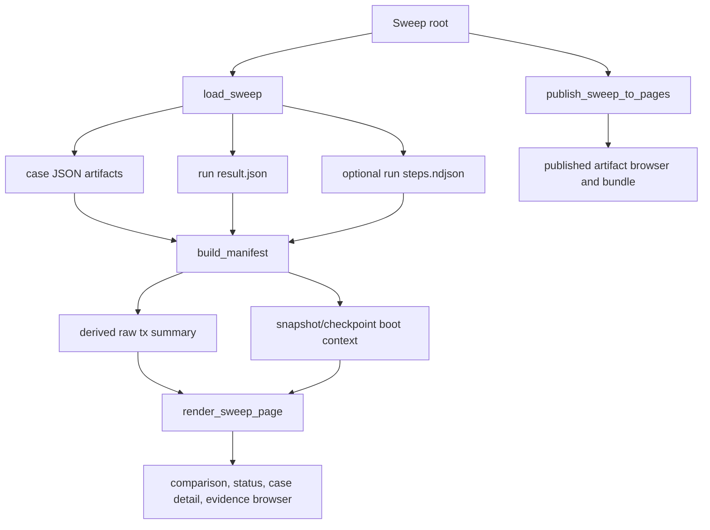

# feat: Surface snapshot boot and raw tx replay in bench pages

## Summary

Extend `scripts/bench_pages` so published SOL benchmark pages make snapshot boot context and V4 raw transaction replay metrics visible from the artifacts the harness already emits. The work should keep old checkpoint-only and no-transaction sweeps rendering unchanged while adding transaction-aware comparison metrics, case detail, and committed regression fixtures.

---

## Problem Frame

Snapshot boot and V4 raw transaction replay are now part of the benchmark harness, but the page publisher still treats most of that evidence as raw artifacts. The manifest already carries some boot context from provenance, and `steps.ndjson` is copied into the artifact bundle, but the loader does not parse per-run step rows and the renderer does not promote raw transaction poke counts, prebuild timings, payload bytes, or RSS evidence into the dashboard.

That means a raw-tx replay sweep can be valid and artifact-complete while the benchmark page still looks like a generic block-poke report. Operators need to see whether a case booted from checkpoint or snapshot, whether raw tx replay actually ran, how much raw tx work was done, and what memory/timing cost came from slab prebuild.

---

## Requirements

**Artifact Ingestion**

- R1. The publisher reads run-level `steps.ndjson` when present and treats it as optional for older sweeps.
- R2. Malformed or missing optional step rows do not break legacy page publishing unless the file is present and invalid enough that the page would otherwise present misleading derived data.
- R3. Run-level step data preserves the difference between an absent raw tx field and a known zero, especially `raw_tx_pokes_completed: 0`.

**Raw Transaction Replay Display**

- R4. The comparison table and KPI area expose `raw_tx_pokes_per_second` when summary artifacts report it.
- R5. Case detail exposes raw tx active block count, raw tx pokes completed, raw tx slabs prebuilt, payload bytes prebuilt, block/raw-tx/prebuild timing split, and slab prebuild RSS start/peak when present.
- R6. Failed or partial steps with preserved prebuild metrics remain visible as benchmark evidence, not hidden because the step outcome was an error.

**Snapshot Boot Display**

- R7. Sweep and case context clearly distinguish checkpoint boot from snapshot boot using trusted plan/provenance fields already present in artifacts.
- R8. Snapshot boot display includes the boot event and input identity available from provenance, resolved case, or trusted plan without inspecting PMA files during page generation.

**Compatibility and Publishing**

- R9. Existing no-transaction, checkpoint-only, native, Docker, and PMA fixtures continue to render without new required fields.
- R10. The artifact browser and published bundle continue to include `steps.ndjson` and source JSON files, subject to the existing run-work-file exclusion.
- R11. Tests use small committed synthetic fixtures, not large session-generated sweeps or `.solarch` payloads.

---

## Key Technical Decisions

- KTD1. **Use existing artifacts first:** Parse `steps.ndjson` and existing `summary.json` fields in `bench_pages` before changing Rust artifact generation. The harness already emits the per-step raw tx fields and `raw_tx_pokes_per_second`; the missing layer is publisher promotion.
- KTD2. **Keep the loader permissive and additive:** Extend the run model with optional step rows instead of turning `bench_pages` into a strict schema validator. Older sweeps must continue publishing, and future harness fields should survive raw JSON round trips.
- KTD3. **Derive display summaries from step rows:** Use summary stats for high-level rates and run step rows for transaction-specific counts, bytes, durations, RSS, outcomes, and partial-failure evidence. `summary.by_step_type` does not carry enough raw tx detail by itself.
- KTD4. **Treat zero as evidence:** `0` raw tx pokes after successful prebuild is materially different from no raw tx metrics. Derived summaries and rendered rows must preserve known-zero values.
- KTD5. **Do not inspect benchmark inputs during page generation:** Snapshot and archive details shown on the page should come from trusted artifacts, not from opening snapshot PMAs, manifests, or `.solarch` files during publishing.
- KTD6. **Use compact committed fixtures:** Regression coverage should create a minimal raw-tx snapshot sweep tree with representative JSON and NDJSON fields. The real 100-block sweep remains useful manual evidence, but it is too large and environment-specific for page tests.

---

## High-Level Technical Design

The page model should have two layers:

- raw data preservation: keep `summary`, `provenance`, `trusted_plan`, `result`, and `steps` available in the manifest for evidence browsing and forward compatibility
- derived display summaries: compute small, stable objects for raw tx replay and boot context so templates do not reimplement field hunting

---

## Scope Boundaries

### In Scope

- `scripts/bench_pages` loader/model changes to ingest optional `steps.ndjson`.
- Manifest and render helpers that derive raw tx replay summaries from run step rows and existing summary metrics.
- Sweep and case page rendering for raw tx replay and snapshot boot context.
- Committed synthetic fixture coverage for snapshot boot plus raw tx replay fields.
- Publisher tests proving the local site tree still includes the relevant artifacts.
- Documentation of the supported artifact contract for page generation.

### Deferred to Follow-Up Work

- Generating new `.solarch`, checkpoint, or snapshot benchmark data.
- Parsing `.solarch`, `.soltest`, PMA, or snapshot manifest files inside `bench_pages`.
- Interactive charts beyond the existing static tables and strip charts.
- Changing Rust artifact schemas unless implementation discovers that a required field is not emitted.
- Cross-sweep transaction-specific delta UI on the registry page beyond carrying the new metrics into manifest/index data.

### Out of Scope

- Reworking the trusted orchestrate harness or raw transaction replay execution.
- Replacing the current Jinja/static-pages architecture.
- Changing GHCR publishing behavior.

---

## Implementation Units

### U1. Ingest Run Step Rows

**Goal:** Teach the loader and run model to read optional `steps.ndjson` from each run directory and preserve it for manifest generation.

**Requirements:** R1, R2, R3, R9, R10

**Dependencies:** None

**Files:**

- `scripts/bench_pages/src/bench_pages/models.py`
- `scripts/bench_pages/src/bench_pages/loader.py`
- `scripts/bench_pages/tests/test_loader.py`
- `scripts/bench_pages/tests/fixtures/raw_tx_snapshot_minimal/**`

**Approach:** Add an optional run-level field, likely `steps: list[dict[str, Any]]`, to `SweepRun`. Implement a small NDJSON reader in `loader.py` that returns an empty list when `steps.ndjson` is absent and parses one JSON object per non-empty line when present. Keep artifact inventory behavior unchanged so `steps.ndjson` remains publishable.

The reader should fail clearly for malformed JSON in a present `steps.ndjson`, because silently ignoring a corrupt step file would make derived raw tx summaries look like "no transaction data." Missing `steps.ndjson` remains normal for legacy fixtures.

**Patterns to follow:** Existing `_load_optional_json`, `_load_json`, `ValidationError`, and permissive fixture handling in `scripts/bench_pages/src/bench_pages/loader.py`.

**Test scenarios:**

- Loading a fixture with `steps.ndjson` attaches parsed rows to `sweep.cases[0].runs[0].steps`.
- Loading existing fixtures without `steps.ndjson` returns an empty step list and preserves current assertions.
- A present malformed `steps.ndjson` raises `ValidationError` with the file path.
- A row containing `raw_tx_pokes_completed: 0` remains `0`, not `None` or absent.
- Artifact inventory still includes `cases/.../runs/run-0/steps.ndjson`.

**Verification:** Existing loader tests pass, and a new raw-tx snapshot fixture demonstrates step-row ingestion without requiring real archive files.

### U2. Add Raw Tx Replay Display Model

**Goal:** Derive compact raw transaction replay summaries for each run and case so templates can render transaction evidence without ad hoc JSON traversal.

**Requirements:** R3, R4, R5, R6, R9

**Dependencies:** U1

**Files:**

- `scripts/bench_pages/src/bench_pages/manifest.py`
- `scripts/bench_pages/src/bench_pages/render.py`
- `scripts/bench_pages/src/bench_pages/value_stats.py`
- `scripts/bench_pages/tests/test_manifest.py`
- `scripts/bench_pages/tests/test_render.py`
- `scripts/bench_pages/tests/fixtures/raw_tx_snapshot_minimal/**`

**Approach:** Add derived manifest fields such as `raw_tx_replay` at run and case scope. The exact shape can be adjusted during implementation, but it should answer the page's display questions directly:

- whether raw tx replay data is present
- raw tx active step/block count
- total and per-run `raw_tx_pokes_completed`
- total `raw_tx_slabs_prebuilt`
- total `raw_tx_payload_bytes_prebuilt`
- timing totals or ranges for block poke, raw tx poke, slab prebuild, block slab prebuild, and raw tx slab prebuild
- start and peak RSS range for slab prebuild
- error rows with raw tx/prebuild metrics preserved

Use `summary.raw_tx_pokes_per_second` for rate-style comparison cells when present. Use step rows for detailed counts and byte/duration fields. Format absent values as `n/a`, but render known-zero values as `0`.

**Patterns to follow:** `CASE_CONTEXT_EXTRACTORS` in `manifest.py`, `_comparison_summary`, `_metric_kpi`, `_format_metric`, and the ValueStats-aware formatting helpers in `render.py`.

**Test scenarios:**

- Manifest for the raw-tx fixture includes a case-level raw tx summary with nonzero tx pokes, slabs, payload bytes, durations, and RSS.
- A block-poke failure row with `raw_tx_pokes_completed: 0` produces `0` in the derived summary.
- An error row after successful prebuild contributes prebuild duration/RSS/count/byte fields to the summary.
- `raw_tx_pokes_per_second` appears in comparison metrics when present in `summary.json`.
- Existing fixtures without raw tx fields omit or mark the derived summary as inactive without adding misleading zero totals.

**Verification:** Manifest JSON remains additive, old summary fields survive unchanged, and renderer tests can consume the new derived model without reading raw artifacts directly.

### U3. Render Snapshot Boot and Raw Tx Replay Sections

**Goal:** Update the sweep page so raw transaction replay and snapshot boot evidence are visible in the primary report, not only in raw JSON.

**Requirements:** R4, R5, R6, R7, R8, R9

**Dependencies:** U2

**Files:**

- `scripts/bench_pages/src/bench_pages/render.py`
- `scripts/bench_pages/src/bench_pages/templates/sweep.html.j2`
- `scripts/bench_pages/src/bench_pages/assets/site.css`
- `scripts/bench_pages/tests/test_render.py`
- `scripts/bench_pages/tests/fixtures/raw_tx_snapshot_minimal/**`

**Approach:** Add raw tx metrics to the existing comparison/KPI ordering with labels and tooltips. Add a transaction replay panel in the case workspace that appears only when the derived raw tx summary is active. Keep it table-first and compact:

- totals row: tx-active blocks, raw tx pokes, slabs, payload bytes
- timing row: block poke, raw tx poke, slab prebuild, block slab prebuild, raw tx slab prebuild
- memory row: slab prebuild RSS start/peak
- failure/progress row when any raw tx step has an error or partial progress

Snapshot boot should be visible through the existing header/case context path and plan summary. Tighten labels if needed so a snapshot boot case reads as snapshot-backed in the first screen and case workspace. Avoid duplicating full trusted plan JSON; the evidence browser already covers that.

**Patterns to follow:** The current `Operation Health`, `Plan Quick Summary`, PMA context labels, and case workspace tables in `sweep.html.j2`.

**Test scenarios:**

- Raw-tx snapshot fixture page includes a visible raw transaction replay section.
- Page includes `Raw tx/s`, raw tx poke count, raw tx slabs, payload bytes, slab prebuild duration, and prebuild RSS labels/values.
- Page renders `0` raw tx pokes completed for a known-zero failure case.
- Page shows snapshot boot context and boot event in header or case metadata.
- Existing fixtures without raw tx data do not render an empty transaction replay panel.
- Existing PMA context tests for checkpoint boot continue passing.

**Verification:** Rendered HTML exposes the new metrics in primary page sections, not only in the raw JSON evidence browser, and visual density remains consistent with the existing table-first page design.

### U4. Add Synthetic Fixture and Publishing Coverage

**Goal:** Add a small committed fixture that represents a snapshot-boot raw-tx replay sweep and prove the publisher preserves both display data and artifacts end to end.

**Requirements:** R1, R3, R6, R7, R8, R10, R11

**Dependencies:** U1, U2, U3

**Files:**

- `scripts/bench_pages/tests/fixtures/raw_tx_snapshot_minimal/matrix.json`
- `scripts/bench_pages/tests/fixtures/raw_tx_snapshot_minimal/matrix_expanded.json`
- `scripts/bench_pages/tests/fixtures/raw_tx_snapshot_minimal/schedule.json`
- `scripts/bench_pages/tests/fixtures/raw_tx_snapshot_minimal/comparison.json`
- `scripts/bench_pages/tests/fixtures/raw_tx_snapshot_minimal/verdict.json`
- `scripts/bench_pages/tests/fixtures/raw_tx_snapshot_minimal/cases/case-000-threads_1/provenance.json`
- `scripts/bench_pages/tests/fixtures/raw_tx_snapshot_minimal/cases/case-000-threads_1/requested_case.json`
- `scripts/bench_pages/tests/fixtures/raw_tx_snapshot_minimal/cases/case-000-threads_1/resolved_case.json`
- `scripts/bench_pages/tests/fixtures/raw_tx_snapshot_minimal/cases/case-000-threads_1/summary.json`
- `scripts/bench_pages/tests/fixtures/raw_tx_snapshot_minimal/cases/case-000-threads_1/verdict.json`
- `scripts/bench_pages/tests/fixtures/raw_tx_snapshot_minimal/cases/case-000-threads_1/runs/run-0/result.json`
- `scripts/bench_pages/tests/fixtures/raw_tx_snapshot_minimal/cases/case-000-threads_1/runs/run-0/steps.ndjson`
- `scripts/bench_pages/tests/test_pages.py`

**Approach:** Build the fixture from minimal JSON modeled after existing `native_pma_minimal` and the observed raw-tx sweep artifacts. Include at least three step rows:

- a successful V4 archive block poke with raw tx pokes and prebuild metrics
- a block-poke failure after successful prebuild with `raw_tx_pokes_completed: 0`
- a raw-tx-poke failure after some raw tx progress

Keep payloads as numeric metrics only; do not include actual `.solarch`, checkpoint, snapshot PMA, or large logs. The goal is page contract coverage, not replay execution.

**Patterns to follow:** Existing fixture tree shape under `scripts/bench_pages/tests/fixtures/native_pma_minimal` and publisher tests in `scripts/bench_pages/tests/test_pages.py`.

**Test scenarios:**

- `publish_sweep_to_pages` writes the raw-tx snapshot page, manifest, and artifact tree.
- Published artifact tree includes `cases/.../runs/run-0/steps.ndjson`.
- Published manifest contains derived raw tx summary fields.
- Hosted-page artifact limiting does not accidentally omit small raw tx evidence files.
- The fixture stays small enough for normal unit-test checkout and does not require local benchmark artifacts.

**Verification:** A local output-dir publish of the fixture produces a self-contained page whose primary sections show snapshot and raw tx replay data.

### U5. Document the Bench Pages Artifact Contract

**Goal:** Record what benchmark artifact fields `bench_pages` now understands so future harness changes keep the page contract in sync.

**Requirements:** R1, R4, R5, R7, R8, R10

**Dependencies:** U1, U2, U3, U4

**Files:**

- `scripts/bench_pages/README.md`
- `docs/solutions/architecture-patterns/sol-benchmark-snapshot-boot-and-v4-raw-tx-replay.md`

**Approach:** Add concise documentation for page-supported snapshot and raw-tx fields:

- provenance/trusted plan fields used for boot display
- summary fields used for rate comparison
- step-row fields used for transaction replay detail
- compatibility behavior for missing `steps.ndjson`
- why pages do not inspect `.solarch` or snapshot PMA files

If `scripts/bench_pages/README.md` does not exist, create it with only publisher contract and local test notes relevant to this script.

**Patterns to follow:** The current solution doc's "Current Bench Pages Limitation" section and existing bench_pages test fixture conventions.

**Test scenarios:** Test expectation: none beyond ensuring documentation names fields that are covered by the committed fixture and render tests.

**Verification:** The documentation gives an implementer or future reviewer a direct map from harness artifacts to page UI without needing to replay the session history.

---

## System-Wide Impact

This is primarily a Python static publisher change, but it affects how benchmark evidence is interpreted. The important contract is that raw transaction replay evidence becomes visible without making the page generator responsible for validating archives or executing benchmark logic. Rust harness artifacts remain the source of truth; `bench_pages` should be a tolerant reader and focused presenter.

Sweep IDs may change if boot or raw-tx context is added to identity inputs. Do that only if the new fields materially distinguish two otherwise-colliding pages. Display summaries can change freely; identity changes should be deliberate.

---

## Risks & Dependencies

- **Risk: page summaries double-count raw tx data.** Mitigate by deriving totals from step rows once and using `summary.raw_tx_pokes_per_second` only for rate display.
- **Risk: absent and zero values are conflated.** Mitigate with tests around `raw_tx_pokes_completed: 0` and inactive/no-data cases.
- **Risk: template logic becomes raw JSON traversal.** Mitigate by building derived display objects in Python helpers before Jinja rendering.
- **Risk: synthetic fixture drifts from real artifacts.** Mitigate by modeling field names after `StepResultWire` and the documented real sweep, and keeping the solution doc updated when the harness schema changes.
- **Dependency: harness artifacts must keep emitting raw tx fields.** Current Rust code exposes `raw_tx_pokes_per_second` in summaries and raw tx fields in `StepResult`/`steps.ndjson`; this plan assumes those remain available.

---

## Acceptance Examples

- AE1. Given a snapshot-boot raw-tx sweep with `steps.ndjson`, when `publish-sweep` renders the page, then the first screen identifies snapshot boot context and shows raw transaction throughput when reported.
- AE2. Given a case with a successful raw-tx block step, when the case workspace is opened, then it shows raw tx pokes completed, slabs prebuilt, payload bytes, timing split, and prebuild RSS.
- AE3. Given a block-poke failure after prebuild with `raw_tx_pokes_completed: 0`, when the page is rendered, then the transaction evidence shows `0` completed raw tx pokes and preserved prebuild metrics.
- AE4. Given an old checkpoint-only sweep with no `steps.ndjson`, when the page is rendered, then existing comparison, PMA context, evidence browser, and artifact browser behavior remain unchanged.

---

## Verification Plan

- Run the bench_pages unit suite with `uv run --project scripts/bench_pages python -m unittest discover -s scripts/bench_pages/tests -v`.
- Run a local publish against the new synthetic fixture and inspect the output HTML for snapshot boot and raw tx replay panels.
- Run a local publish against an existing no-raw-tx fixture to confirm the new panels are absent and legacy tests still pass.
- If a real session sweep is available, run `publish-sweep --sweep-root <raw-tx-sweep> --output-dir <tmp-output>` as manual evidence that the real artifact shape renders without fixture-only assumptions.

---

## Sources & Research

- `scripts/bench_pages/src/bench_pages/loader.py` currently loads `result.json` but not `steps.ndjson`.
- `scripts/bench_pages/src/bench_pages/manifest.py` already derives PMA boot context from provenance fields such as `boot_source`, `boot_event_num`, `runtime_flavor`, and `pma_work_dir_mode`.
- `scripts/bench_pages/src/bench_pages/render.py` already renders summary metrics, operation health, readable plan boot text, run tables, and PMA context labels.
- `scripts/bench_pages/src/bench_pages/templates/sweep.html.j2` is the primary page surface for comparison, summary, case workspace, evidence, and artifacts.
- `crates/nockchain-bench/src/speed_of_light/harness/summary.rs` exposes `raw_tx_pokes_per_second`.
- `crates/nockchain-bench/src/speed_of_light/orchestrator.rs` serializes raw tx step fields including poke counts, prebuild durations, slab counts, payload bytes, and RSS.
- `docs/solutions/architecture-patterns/sol-benchmark-snapshot-boot-and-v4-raw-tx-replay.md` documents the session learning and current bench_pages limitation.
