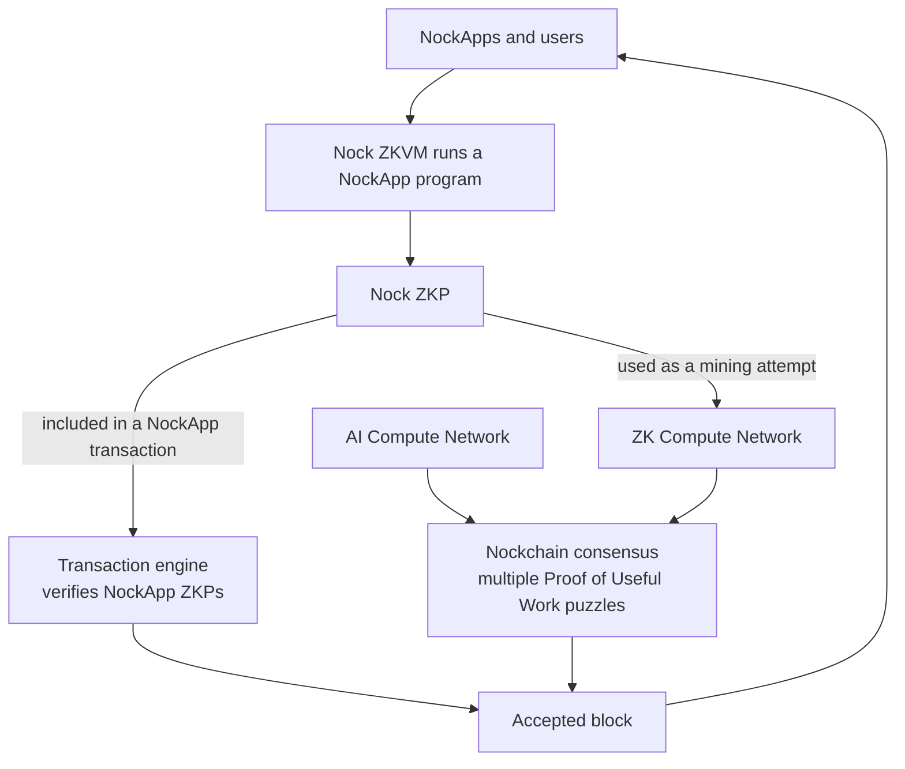

# Nockchain

**Nockchain is a protocol for the development of decentralized hyperscalers. Nockchain is a programmable, private economy powered by NOCK, a fair digital gold.**

A decentralized hyperscaler coordinates large amounts of useful compute from independent providers. Nockchain provides decentralized compute and a private, programmable economy through two systems:

1. **Compute Networks** secure consensus through multiple Proof of Useful Work puzzles.
2. **NockApps** use Nock ZKPs to provide programmability and privacy.

A block must pass both consensus and transaction validation before nodes accept it.

## Consensus

A Compute Network is a compute puzzle that can produce valid Nockchain blocks. Miners choose a Compute Network, perform its task, and check whether the result meets its difficulty target. When a result meets the target, the miner submits a block with a proof of the work. Other nodes verify the proof.

### The First ZK Compute Network

Nockchain launched in May 2025 with a deliberately non-useful first version of the **ZK Compute Network**: the dumb ZK puzzle. Miners produced zero-knowledge proofs of a fixed Nock program. A zero-knowledge proof, or ZKP, shows that a program ran correctly without making every node run it again.

The fixed program did not produce a useful result for a customer. It had two purposes:

- Test whether ZKPs could be used as the work behind Proof-of-Work consensus.
- Reward miners for finding faster and cheaper ways to produce ZKPs.

A more efficient prover could make more mining attempts and earn more block rewards. Nockchain used mining competition to improve ZK proving.

### Current Compute Networks

Nockchain now has two Compute Networks:

- **The AI Compute Network** uses matrix multiplication from AI inference. An AI provider can use the same computation for its AI workload and for Nockchain mining. If the result meets the target, the provider generates a proof and submits a block.
- **The ZK Compute Network** still starts from the fixed ZK puzzle. It is intended to upgrade to the general-purpose **Nock ZKVM**. The Nock ZKVM can run any Nock program and produce a proof of the result. Miners will be able to prove useful programs for NockApps and use the same proofs as mining attempts.

Both Compute Networks produce blocks for the same Nockchain. Each has its own difficulty. Nockchain measures the work from both networks and adds it to the same chain total. Nodes accept the valid chain with the most total work.

## NockApps

Nockchain will support **NockApps** by adding Nock ZKP verification to the transaction engine.

A NockApp defines its rules as a Nock program. The program runs in the Nock ZKVM and produces a proof of its result. The NockApp includes that proof in a transaction. The transaction engine verifies the proof without running the NockApp program again.

This provides two main features:

- **Programmability.** A NockApp can use any rules that can be written as a Nock program. The transaction engine does not need a new built-in rule for each NockApp. It only needs to verify the Nock proof.
- **Privacy.** A NockApp can keep private inputs outside the public transaction. Nodes receive the proof and any public result, but they do not need the private inputs to verify that the NockApp followed its rules.

After the proof verifies, Nockchain can accept the NockApp’s proven state change. This gives NockApps onchain settlement without requiring public execution of the NockApp program.

The transaction engine and the ZK Compute Network will use the same Nock proof format. One proof can therefore do two things:

1. Approve a NockApp state change in a transaction.
2. Serve as a mining attempt in the ZK Compute Network.

## Where Participants Fit

- **AI providers** can use AI computation for mining attempts.
- **ZK provers** can produce proofs for NockApps and use them as mining attempts.
- **NockApp developers** can write NockApp rules as Nock programs, keep selected inputs private, and settle proven results onchain.
- **Node operators** verify blocks, Compute Network proofs, and NockApp proofs.
- **Users** use NockApps and authorize transactions.

Compute Networks make Nockchain a protocol for decentralized hyperscalers. NockApps provide programmability and privacy. NOCK is the fair digital gold that powers the economy.

## How It Fits Together

The AI Compute Network and the planned general-purpose ZK Compute Network are the first Proof of Useful Work puzzles in this model. Nock ZKP verification gives NockApps programmability and privacy. The shared Nock proof format connects useful ZK work to onchain NockApps.
