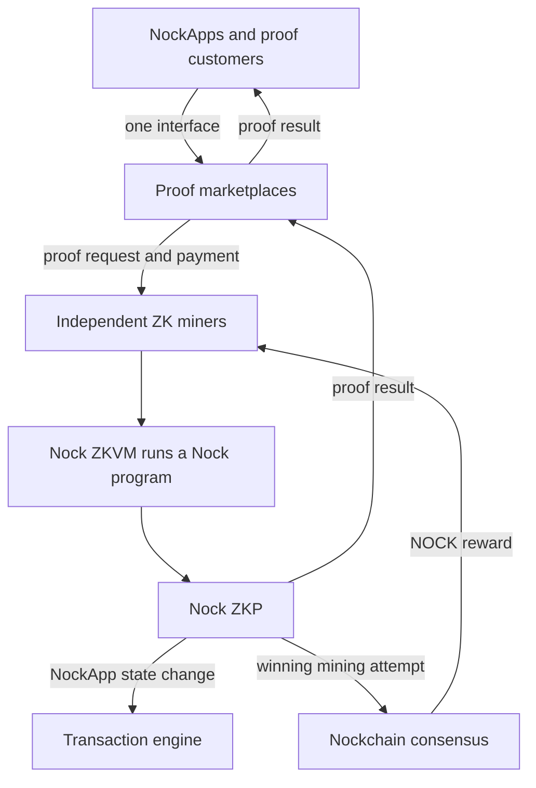

# The ZK Compute Network

**The ZK Compute Network will turn general-purpose zero-knowledge proving into useful consensus work. NockApps and other customers will request proofs. Independent ZK miners will produce those proofs and use the same work to compete for NOCK block rewards. Together, these miners can form a decentralized ZK hyperscaler.**

Nockchain launched in May 2025 with a fixed ZK puzzle. The puzzle did not produce a useful result for a customer. It tested ZK proofs as the work behind Proof of Work consensus. It also rewarded miners for making ZK proving faster and cheaper.

The next step replaces the fixed puzzle with useful programs requested by customers.

## The Product

The ZK Compute Network will create an open market for proving Nock programs.

The Nock ZKVM can run a Nock program and produce a zero-knowledge proof, or ZKP, of the result. The proof lets another system verify the result without running the full program again.

A ZKP can also keep private inputs off the public chain. Nodes receive the proof and any public result. They do not need the private inputs to verify that the program followed its rules.

Different customers can request different proofs:

- NockApps can prove private and programmable state changes.
- Bridges can prove events from another network.
- Services can prove that they followed a required process.
- Developers can prove any computation that they can express as a Nock program.

Independent marketplaces can connect customers with available ZK miners. They can handle job discovery, pricing, payments, and service monitoring. Nockchain provides the shared proof and mining rules.

## How One Proof Request Works

One request follows five steps:

1. A customer requests a proof of a Nock program.
2. A ZK miner runs the program in the Nock ZKVM.
3. The ZK miner produces a Nock ZKP and returns it to the customer.
4. The customer uses the proof for a NockApp transaction or another service.
5. If the proof also wins the mining attempt, the ZK miner submits a block and earns NOCK.

Most useful proofs will not produce a block. They still provide the result that the customer requested.

The ZK miner does not create a customer proof and then perform unrelated mining work. The useful proof is the mining attempt.

## Why ZK Miners Join

A ZK miner can receive two kinds of revenue from the same proving work:

1. Customer payments for useful proofs.
2. A chance to earn NOCK block rewards.

The additional expected revenue can lower proof prices, improve margins, or fund more proving hardware. More efficient miners can serve more customers and make more mining attempts.

This incentive continues the work that Nockchain started with the dumb ZK puzzle. The first puzzle rewarded prover efficiency. The useful ZK Compute Network applies that efficiency to customer programs.

More miners give customers more proving capacity, faster service, and more choice. Their combined capacity can grow to cloud scale without placing all proving hardware under one company.

## How It Fits Into Nockchain

The ZK Compute Network is one of Nockchain’s Compute Networks. Each Compute Network defines a Proof of Useful Work puzzle that can produce Nockchain blocks.

Nockchain will use the same Nock proof format in two places:

- The ZK Compute Network will use it for consensus mining.
- The transaction engine will use it to verify NockApp state changes.

This shared format gives each proof two possible uses. It can settle a useful computation for a customer. It can also serve as a Nockchain mining attempt.

The transaction engine will verify the proof without running the NockApp program. This gives NockApps general programmability and privacy while keeping verification simple for nodes.

Nockchain provides block candidates, mining targets, proof verification, and NOCK rewards. Proof marketplaces and NockApps provide the customer-facing products.

More NockApp activity creates more demand for useful proofs. More proof demand creates more consensus work. More ZK miners increase the proving capacity available to every customer.

The ZK Compute Network shows how Nockchain supports decentralized hyperscalers. An open protocol connects independent proving hardware, customer demand, NockApps, and consensus rewards.

## How It Fits Together

Customers pay for useful proofs. NOCK rewards pay miners for using the same proving work to secure Nockchain. The combined proving capacity becomes a decentralized ZK hyperscaler.
